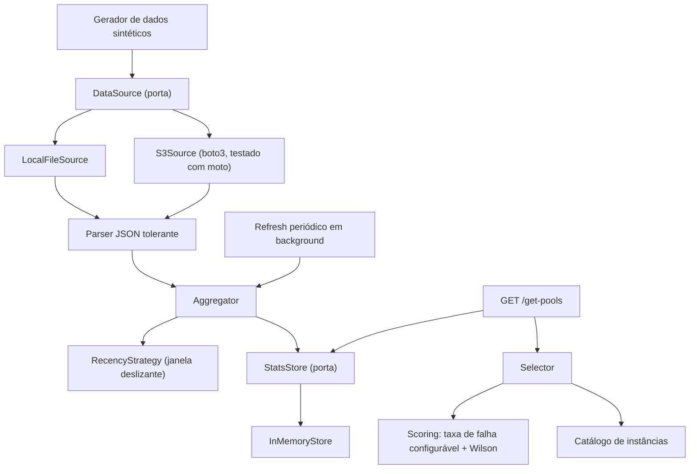

# Arquitetura

Monólito modular com arquitetura em portas & adapters (hexagonal). Duas portas
centrais isolam o domínio da infraestrutura: `DataSource` (de onde os eventos
vêm) e `StatsStore` (onde o agregado computado é lido/escrito). A API nunca toca
infraestrutura diretamente, sempre através dessas portas. Veja
[`docs/adr/0001-ports-and-adapters.md`](adr/0001-ports-and-adapters.md) para a
justificativa das portas, e
[`docs/adr/0009-modular-monolith-over-microservices.md`](adr/0009-modular-monolith-over-microservices.md)
para por que monólito em vez de microsserviços.

> O GitHub renderiza este diagrama nativamente. Para editar/visualizar fora
> do GitHub, cole o bloco no [Mermaid Live Editor](https://mermaid.live/) ou
> instale o [Mermaid CLI](https://github.com/mermaid-js/mermaid-cli)
> (`@mermaid-js/mermaid-cli`) para renderizar localmente.

## Fluxo de requisição

`GET /get-pools` -> `Selector` -> lê o `StatsStore` (em memória, já agregado) ->
aplica o filtro de tipo/família/categoria (via o catálogo de instâncias) ->
calcula o score de cada pool (reasons de falha configuráveis + limite inferior
de Wilson) -> a `RecencyStrategy` ativa já está refletida no agregado que ele lê
-> resolve empates (veja
[`docs/adr/0003-wilson-lower-bound-confidence.md`](adr/0003-wilson-lower-bound-confidence.md)
e
[`docs/adr/0004-pluggable-recency-strategy.md`](adr/0004-pluggable-recency-strategy.md))
-> responde.

Nenhum I/O de fonte de dados acontece nesse caminho, ingestão e agregação rodam
desacopladas, numa tarefa em background com refresh periódico (veja
[`docs/adr/0002-no-database-in-memory-aggregate.md`](adr/0002-no-database-in-memory-aggregate.md)).
Se a fonte de dados ficar temporariamente indisponível, o último agregado
válido continua sendo servido, e o processo nunca cai por causa de uma falha de
ingestão.

## Componentes

| Componente | Responsabilidade |
| ---------- | ----------------- |
| `domain/models.py` | Modelos de domínio puros: `JobEvent`, `PoolId`, `PoolStats`, `RankedPool` |
| `domain/reason_classification.py` | Mapeamento configurável de `reason` -> categoria (`AVAILABILITY_FAILURE` / `JOB_FAILURE`) |
| `domain/catalog.py` | Catálogo estático de família de instância -> categoria de workload, com fallback pela convenção de nomenclatura da AWS |
| `domain/recency.py` | Protocolo `RecencyStrategy`: `SlidingWindowStrategy` (implementação padrão) |
| `domain/scoring.py` | `raw_score`, `wilson_lower_bound`, `confidence_score` |
| `domain/selector.py` | Cadeia de filtro, scoring, ranking e desempate |
| `ingestion/source.py` | Porta `DataSource` + adapters `LocalFileSource` / `S3Source`. Os dois fazem pruning de leitura pelas partições `dt=/hr=` da janela de recência ([`docs/adr/0008-s3-source-partition-pruning.md`](adr/0008-s3-source-partition-pruning.md)) |
| `ingestion/parser.py` | Parser JSON tolerante (linhas malformadas são ignoradas, não fatais) |
| `ingestion/aggregator.py` | Transforma eventos parseados em `PoolStats` por pool, já filtrado por recência |
| `store/stats_store.py` | Porta `StatsStore` + adapter `InMemoryStore` (troca atômica) |
| `store/refresh.py` | Refresh periódico em background, com degradação graciosa em caso de falha da fonte |
| `api/app.py` | Montagem da app FastAPI, wiring de inicialização, middleware de logging |
| `api/routes.py` | `GET /get-pools`, `GET /health`, `GET /ready` |
| `api/schemas.py` | Schemas Pydantic de resposta que espelham o `RankedPool` do domínio |
| `observability/logging.py` | Logging estruturado em JSON |
| `settings.py` | Loader de configuração tipado (`pydantic-settings`) sobre `.env` |
| `tools/generate_data.py` | Gerador determinístico de dados sintéticos em JSON (regras: [`docs/synthetic-data.md`](synthetic-data.md)) |
| `tests/unit/` | Testes unitários: `domain/` (puro, sem I/O), `observability/`, `settings.py` |
| `tests/integration/` | Testes de integração: `api/` (FastAPI `TestClient`), `ingestion/` (inclui `S3Source` via `moto`), `store/` (refresh assíncrono) |
